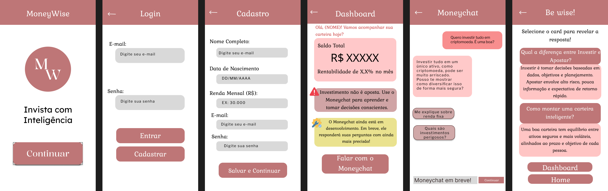

# 💼 MoneyWise

> Aplicativo mobile focado em **conscientização financeira**, ajudando usuários a diferenciar **investimento** de **aposta** por meio de conteúdo educativo, alertas de risco e um chat com **IA (Moneychat)**.

---

## 🚀 Alunos:
- Camila do Prado Padalino - RM98316
- Felipe Cavalcante Bressane - RM97688
- Gabriel Teixeira Machado - RM551570
- Guilherme Brazioli - RM98237

---

## 🖼️ Protótipo no Figma

> [Acesse o design aqui](https://www.figma.com/proto/JWp8bp8wZR4vII4Y3cy529/MoneyWise-App?node-id=3-2&t=Ai8ybSaRkaZMok2K-1)

---

## 📱 Sobre o App

**MoneyWise** é um app mobile desenvolvido em **React Native (Expo)**, com o objetivo de:

- 📊 Conscientizar sobre práticas de investimento seguras
- 🤖 Utilizar uma IA educativa (Moneychat) para alertar sobre riscos
- 📚 Oferecer trilhas de aprendizado sobre finanças
- 🧠 Estimular decisões informadas e evitar apostas disfarçadas de investimentos

---

## 🧠 Como o app combate comportamentos de aposta
O MoneyWise atua diretamente na conscientização financeira ao identificar comportamentos de risco, como alocações impulsivas ou investimentos concentrados, e oferece orientações educativas via IA (Moneychat), alertas visuais no dashboard e conteúdos interativos sobre risco e retorno. Assim, o app transforma o ato de investir em uma experiência consciente e planejada, reduzindo apostas disfarçadas de decisões financeiras.

---

## ✨ Funcionalidades

- ✅ Login e autenticação simulada
- ✅ Cadastro do usuário para utilização do aplicativo
- ✅ Dashboard com saldo e rentabilidade
- ✅ Alertas personalizados sobre riscos
- ✅ IA educativa (Moneychat) com linguagem simples
- ✅ Trilhas com cards interativos de aprendizado

---

## 🏗️ Arquitetura & Persistência

O projeto foi **aprimorado** para usar **Firebase** como backend de autenticação e persistência (substituindo a persistência local).  
As operações de **CRUD de usuário** são feitas via **serviço de API** integrado ao Firebase (Authentication + Firestore).

---

## 👤 CRUD & Gerenciamento de Usuários

- **Cadastro**: cria conta com email/senha (Authentication) e documento do usuário (Firestore)  
- **Login**: autenticação via Firebase  
- **Leitura**: busca dados do usuário (ex.: nome, renda) no Firestore  
- **Atualização**: **EditarPerfil** permite atualizar email/senha  
- **Exclusão de conta**: remove do Authentication e apaga dados do Firestore
